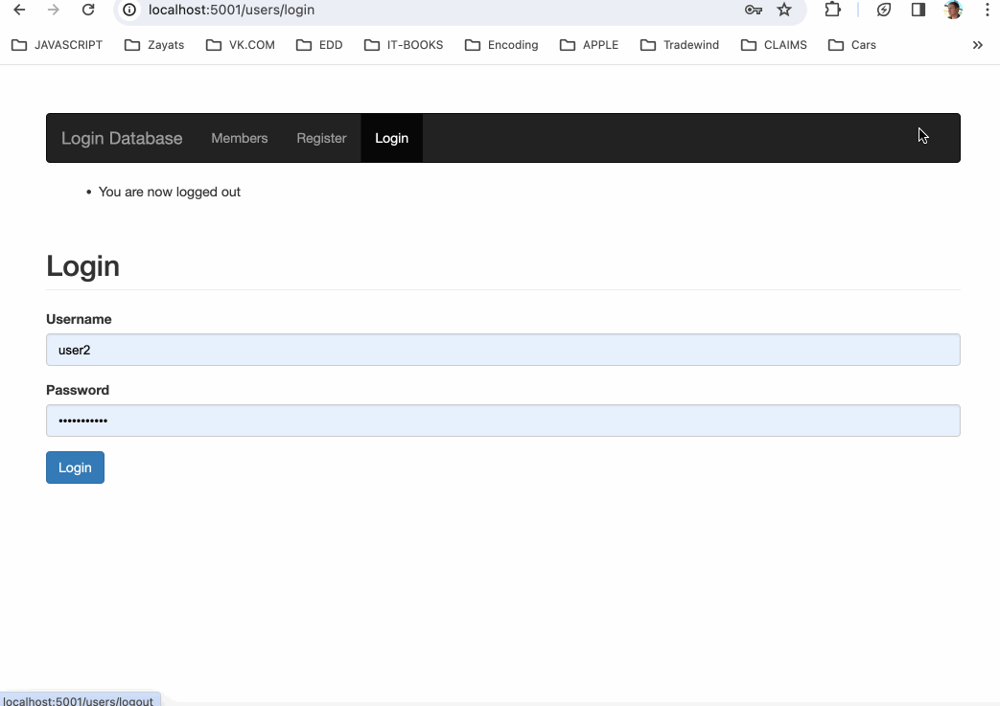

# Node JS login portal application

This application is a full fledged login portal connected with mongodb and the email verification and then login. If not a member then you need to register to the portal

## Requirements

You need to have mongodb installed in your system

## Dependencies

To install all the dependencies:

```
npm install
```

## To run the application

```
nodemon app.js
      or
  npm start
```

### The challenge gif-shot:



## Initially made by:

### Deepankur Lohiya
